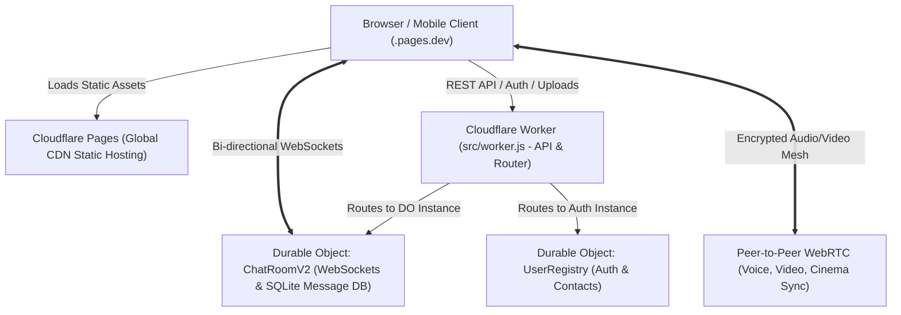

# FastChat - Edge-Native Real-Time Chat and Multimedia Platform

> Zero-Knowledge. Zero-Tracking. Blazing-Fast Edge Performance.
> Built entirely on Cloudflare Pages, Cloudflare Workers, and Cloudflare SQLite Durable Objects.

---

## What is FastChat?

FastChat is a modern, high-performance, real-time messaging and multimedia social web application. It is designed to run completely serverless at the edge on Cloudflare's global network spanning 330+ cities worldwide.

### Key Highlights:
- **Zero-Knowledge Privacy**: No email, no phone number, no tracking. Instant anonymous or pseudonymous registration.
- **Ultra-Low Latency Messaging**: Real-time two-way WebSocket messaging powered by Cloudflare Durable Objects (<15ms edge ping).
- **Live Typing Peek**: See messages assemble live as your peer types (with seamless morph-to-message rendering).
- **WebRTC Voice and Video Calls**: Crystal-clear peer-to-peer encrypted calling with zero server media relay overhead.
- **Synchronized Cinema and Watch Party**: Stream videos, YouTube, and music together in real-time frame synchronization with friends.
- **Pulse Peer Matchmaker**: Instant anonymous 1-on-1 topic-based chat matching.
- **Spaces (Group Chats)**: Persistent multi-user group chat rooms with member roles and active presence.
- **WhatsApp-Grade Gestures**: Smooth horizontal swipe-to-reply, touch-optimized fluid scrolling, and rich media lightboxes.

---

## Architecture Overview



1. **Frontend (`public/`)**:
   - Plain HTML5, CSS3, and modern Vanilla JavaScript (zero bloated frontend frameworks).
   - Instant cold-load times (<200ms).
   - IndexedDB local message caching for instant offline chat rendering.
   - Hosted on Cloudflare Pages.

2. **Backend Router (`src/worker.js`)**:
   - Serverless JavaScript running on Cloudflare Workers.
   - Handles authentication, CORS, rate limiting, and HTTP-to-WebSocket upgrades.

3. **Real-time State and Storage (`src/chatroom.js`, `src/user_registry.js`)**:
   - Cloudflare Durable Objects: Stateful edge microservices with dedicated in-memory state and embedded SQLite storage.
   - Every chat room runs in its own dedicated Durable Object instance located physically closest to the users.

---

## Project Directory Structure

```text
fastchat/
├── public/                       # Frontend Web Application (Cloudflare Pages)
│   ├── index.html                # Main UI (Login, Chat, Groups, Pulse matchmaker)
│   ├── style.css                 # Responsive CSS design system and animations
│   ├── app.js                    # Core logic, WebSocket client, IndexedDB caching
│   ├── calls.js                  # WebRTC P2P voice and video call engine
│   ├── cinema.js                 # Synchronized cinema video player
│   ├── watchparty.js             # Synchronized watch party module
│   ├── converter.html            # Client-side media conversion utility
│   ├── diagnostics.html          # Network and WebSocket diagnostic dashboard
│   ├── manifest.json             # Progressive Web App (PWA) manifest
│   ├── sw.js                     # Service Worker for offline asset caching
│   └── _headers                  # Cloudflare Pages security and caching headers
│
├── src/                          # Backend Edge Worker & Durable Objects
│   ├── worker.js                 # Main Cloudflare Worker API router & WebSocket entry
│   ├── chatroom.js               # ChatRoomV2 Durable Object (storage, reactions, presence)
│   ├── chatroom-convoo.js        # Pulse matchmaking and Spaces extensions
│   ├── user_registry.js          # User registration, authentication, contacts DO
│   └── user_registry-convoo.js   # Mutual contact handshake extensions
│
├── .agent/                       # Automated development workflows
│   └── workflows/
│       ├── deploy-backend.md     # Step-by-step backend deployment
│       └── deploy-frontend.md    # Step-by-step frontend deployment
│
├── DEPLOY_MAC.md                 # Comprehensive step-by-step Mac deployment guide
├── AGENTS.md                     # Technical Manual for AI Agents (Cursor/Claude/GPT)
├── RULES.md                      # Critical architectural rules and invariants
├── .cursorrules                  # Cursor IDE configuration and instruction rules
├── .gitignore                    # Git ignore file (excludes node_modules, .wrangler, .DS_Store)
├── package.json                  # NPM scripts for building, testing, and deploying
└── wrangler.toml                 # Cloudflare Wrangler deployment configuration
```

---

## Quick Start (Mac & Linux)

For a complete step-by-step beginner guide, see:
[DEPLOY_MAC.md](DEPLOY_MAC.md)

### 1. Install Dependencies
```bash
npm install
```

### 2. Login to Your Cloudflare Account
```bash
npx wrangler login
```

### 3. Deploy the Backend Worker
```bash
npm run deploy:backend
```
Cloudflare will output your backend URL, for example:
```text
Published fastchat-backend (1.23 sec)
  https://fastchat-backend.<your-account-subdomain>.workers.dev
```

### 4. Connect Frontend to Your Backend
Open `public/app.js` and update line 53 with your backend URL:
```javascript
const API_BASE = 'https://fastchat-backend.<your-account-subdomain>.workers.dev';
```

### 5. Deploy the Frontend to Cloudflare Pages
```bash
npm run deploy:frontend
```
Type your own unique project name (for example `alex-chat` or `fastchat-live`), and your live website will be ready at:
```text
https://<your-project-name>.pages.dev
```

---

## Admin Controls and Site Management

FastChat includes built-in administrative tools. By default, all admin endpoints are locked and return 403 Forbidden until you set your own secret.

### 1. Set Your Admin Key
In your terminal:
```bash
npx wrangler secret put ADMIN_KEY
```
Enter your secret master password when prompted.

### 2. Run the Interactive Admin Tool
- On macOS / Linux: `./admin.sh`
- On Windows: `.\admin.ps1`

Features available in the admin tool:
- List all registered users and passwords in a formatted table
- Change or reset any user's password
- Delete a user account, contacts, and active sessions
- Wipe all chat rooms, messages, and user accounts (Full Reset)
- Disable / enable new user registrations

---

## For AI Coding Assistants

If you are using Cursor, Claude Code, Copilot, or ChatGPT to develop or modify this codebase, make sure your agent reads:
- [AGENTS.md](AGENTS.md): Deep architectural guide, WebSocket protocols, Durable Objects lifecycle, and edge storage patterns.
- [RULES.md](RULES.md): Sacred architectural rules including mobile web safe-areas, WhatsApp gesture architecture, zero programmatic focus, and optical centering.

---

## License
ISC License.
